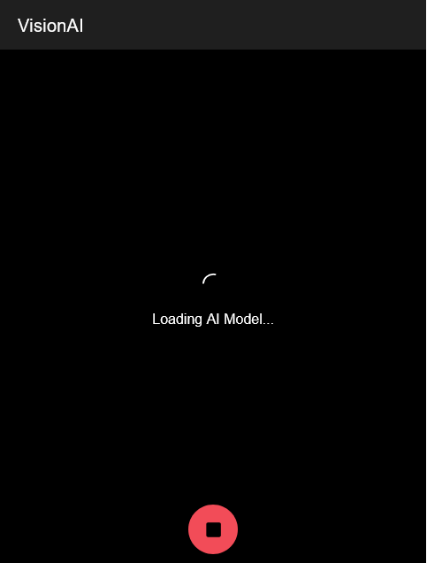
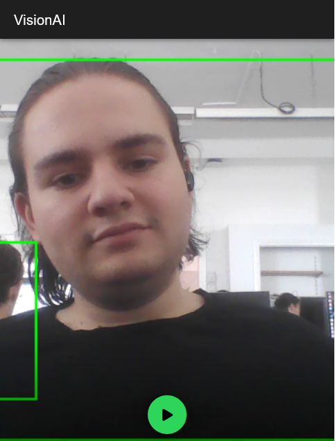
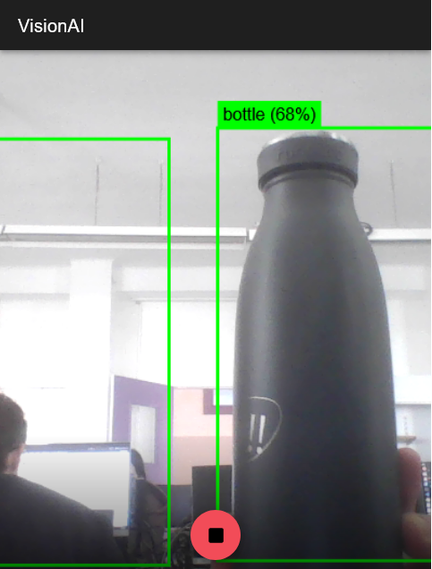
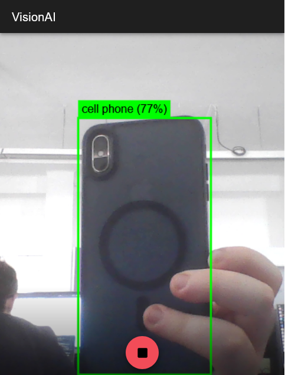
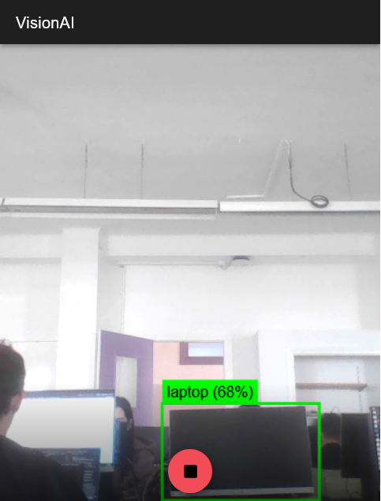

# INFORME DE PROYECTO: VisionAI (AEA2 - RA2)

## 1. Explicación de las funcionalidades de la aplicación

**VisionAI** es una aplicación móvil híbrida diseñada para la detección de objetos en tiempo real directamente en el dispositivo del usuario.

### Características Principales:
- **Detección de Objetos Cotidianos:** Identifica hasta 80 categorías de objetos (personas, sillas, botellas, etc.) usando la cámara trasera.
- **Visualización en Tiempo Real:** Dibuja recuadros verdes (bounding boxes) y etiquetas de confianza sobre el feed de video.
- **Privacidad y Autonomía (100% Offline):** No requiere conexión a internet ni envía datos a la nube; el modelo de IA reside físicamente en la aplicación.
- **Interfaz Intuitiva:** Botón de inicio/parada simple y pantalla completa para la vista de cámara.

### Casos de Uso:
- Ayuda visual para identificación de objetos.
- Demostración de capacidades de IA local en dispositivos móviles.

---

## 2. Capturas de la aplicación

### Interfaz Inicial



### Pruebas de Detección




---

## 3. Procés d’especificació (Spec-Driven Development)

Hemos aplicado la metodología **Speckit**, dividiendo el desarrollo en fases lógicas y documentadas:

### a. Foundations (CONSTITUTION.md)
En esta fase definimos las reglas de oro: el uso de Vue 3 (Composition API), la obligatoriedad del modo offline y la prioridad absoluta del rendimiento (FPS) en el dispositivo móvil.

### b. Specify (SPEC.md)
Aquí detallamos el comportamiento esperado: la apertura de la cámara trasera, la superposición de un Canvas transparente y el feedback visual que el usuario debe recibir al detectar un objeto.

### c. Planning (PLAN.md & tasks.md)
La planificación técnica consistió en estructurar servicios independientes para la cámara y la IA, elegir el modelo Coco-SSD Lite y definir estrategias de optimización como el throttling de frames y la reducción de resolución para garantizar fluidez.

---

## 4. Anexo con ficheros relevantes

### Contenido de CONSTITUTION.md:
```markdown
# Constitution: VisionAI

## Role
Lead Developer experto en desarrollo móvil híbrido.

## Guiding Principles
1. **Tech Stack:** 
   - Framework: **Vue 3** con **Ionic Framework** y **Capacitor**.
   - Style: **Composition API** utilizando `<script setup>`.
2. **On-Device AI (Strict Rule):**
   - La aplicación debe funcionar **100% offline**. 
   - Prohibido el uso de APIs externas para la inferencia. Todo el procesamiento ocurre en el dispositivo.
3. **Performance & Efficiency:**
   - El rendimiento es crítico. La detección debe ser fluida sin congelar la interfaz de usuario.
   - Gestión estricta de memoria (limpieza de tensores, gestión de ciclos de vida).
4. **Code Quality:**
   - Código limpio, modular y mantenible.
   - Manejo robusto de errores y permisos nativos.

## Technical Foundation
- **JS Motor:** TensorFlow.js
- **Model:** Coco-SSD
- **Bridge:** Capacitor (Camera & Hardware access)
```

### Contenido de SPEC.md:
```markdown
# Specification: VisionAI - Real-Time Object Detection

## 1. Functional Overview
The application is a real-time computer vision tool that identifies everyday objects through the device's rear camera. It provides immediate visual feedback by highlighting detected objects with bounding boxes and labels.

## 2. User Journey
1. **Entry:** User opens the app and sees a clean interface with a "Start Detection" button.
2. **Camera Access:** Upon clicking "Start", the app requests camera permissions (via Capacitor) and opens the rear camera.
3. **Detection Loop:** The app starts the inference engine. The video stream is processed frame-by-frame.
4. **Visual Feedback:** 
   - A green bounding box (2px width) appears around detected objects.
   - A label above the box shows the object name (e.g., "Person") and confidence (e.g., "92%").
5. **Control:** User can stop the detection at any time, which freezes/closes the camera and clears the overlay.

## 3. Technical Requirements
- **Camera:** Access to `environment` (rear) camera using HTML5 MediaDevices with Capacitor permission handling.
- **Inference Engine:** TensorFlow.js with the `coco-ssd` model.
- **Drawing:** High-performance Canvas overlay synchronized with the `<video>` element.
- **Performance Goal:** Minimal latency between object movement and box update.
- **Offline Capability:** All models and assets must be bundled or cached for 100% offline use.

## 4. User Interface (UI) Design
- **Header:** Simple Ionic toolbar with the app title "VisionAI".
- **Main View:** Full-width/height camera preview container.
- **Overlay:** Transparent Canvas layer for bounding boxes.
- **Footer/Controls:**
  - A large, floating action button (FAB) or centered button at the bottom to "Start/Stop Detection".
  - Status indicator (e.g., "Model Loading...", "Ready").

## 5. Scope of Detection
The app will detect classes supported by the Coco-SSD model, including but not limited to:
- People, Cars, Bicycles.
- Household items: Chairs, Tables, Bottles, Cups, Mobile phones.
- Animals: Dogs, Cats.
```

### Contenido de tasks.md:
```markdown
# Tasks: VisionAI

## Phase 1: Project Setup & Environment
- [x] **Task 1: Initialize Ionic/Vue Project**
- [x] **Task 2: Install Core Dependencies**

## Phase 2: Offline AI Configuration
- [x] **Task 3: Setup Offline Model Assets**
- [x] **Task 4: Implement AI Service**

## Phase 3: Hardware & Detection Loop
- [x] **Task 4: Implement Camera Service**
- [x] **Task 5: Create Detector Component (The Loop)**

## Phase 4: UI & Visual Feedback
- [x] **Task 6: Implement Canvas Overlay**
- [x] **Task 7: Design Main UI**

## Phase 5: Build & Native Validation
- [x] **Task 8: Android Configuration & Build**
```

### Contenido de PROMPTS.md:
```markdown
# Informe de Proyecto: VisionAI

## 1. Elección del Modelo y Configuración Offline
### Modelo: Coco-SSD (ssdlite_mobilenet_v2)
Hemos seleccionado el modelo **Coco-SSD** en su versión **Lite** por su equilibrio entre precisión y velocidad en móviles.

### Configuración 100% Offline
1. **Host Local:** Archivos alojados en `public/models/coco-ssd/`.
2. **Carga Forzada:** URL local (`/models/coco-ssd/model.json`).

## 2. Historial de Prompts (Metodología Speckit)
Detallamos los prompts clave:
- **/speckit.constitution:** Definición de reglas de oro y stack.
- **/speckit.specify:** Comportamiento funcional y UI.
- **/speckit.plan:** Arquitectura técnica y estrategia offline.
- **/speckit.implement (Optimización):** Throttling de frames y limpieza de tensores.

## 3. Decisiones Arquitectónicas Clave
1. **Throttling de Inferencia:** Procesar 1 de cada 3 frames.
2. **Sincronización Video-Canvas:** Superposición exacta.
3. **Gestión de Tensores:** Uso de `tf.tidy()` para evitar fugas de memoria.
4. **Arquitectura de Servicios:** Singletons para IA y Cámara.
```
